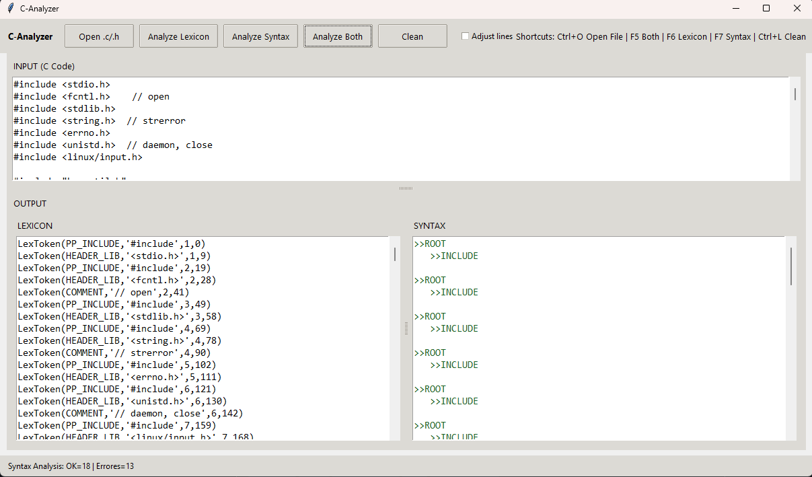

## Problem
When learning compiler fundamentals, it’s hard to **see** how C source code becomes tokens and how grammar rules validate structure. I wanted a practical desktop tool that makes lexing/parsing more tangible with immediate feedback.

## What I built
A Tkinter desktop app that:
- Lets you paste **C code** in an input editor
- Produces a **token stream** (lexer output)
- Runs **syntax parsing** using a custom grammar (subset of C)
- Prints a readable, tree-like representation of recognized rules (or clear syntax errors)

## Highlights
- **Lexer coverage:** common C keywords, identifiers, numbers, strings, operators, preprocessor directives, and more.
- **Parser coverage (subset):** `if/else`, `for`, `while`, `switch/case`, declarations, assignments, expressions, arrays, and function declarations.
- **More robust input handling:** ignores inline comments (`// ...`) for syntax checks and skips unsupported lines like `typedef` / `static` declarations so the analyzer can focus on the supported grammar.
- **Packaging improvements:** `pyproject.toml`, `__init__.py` modules, and a cleaner runnable entry (renamed `screen.py` → `app.py`).

## Architecture
- `analyzers/lexicon.py`: lexer rules + token definitions (PLY Lex)
- `analyzers/syntax.py`: grammar rules + parser (PLY Yacc)
- `ui/app.py`: Tkinter UI + wiring (analyze lexicon / syntax / both)
- `assets/`: UI assets (if present)

## How to run

### Option A: Install as a package (recommended)
```bash
# from the repo root
pip install -e .
# or, if you have dev extras configured:
# pip install -e ".[dev]"
```

#### Run the UI:
```bash
python -m ui.app
# or
python ui/app.py
```

### Option B: Minimal dependencies
```bash
pip install ply
python ui/app.py
```

## Usage
1. Paste C code into the INPUT panel or select a file
2. Click
   - Analyze Lexicon to see tokens,
   - Analyze Syntax to parse supported grammar,
   - Analyze Both to run both steps.
  

## 📷 Screenshots

 
