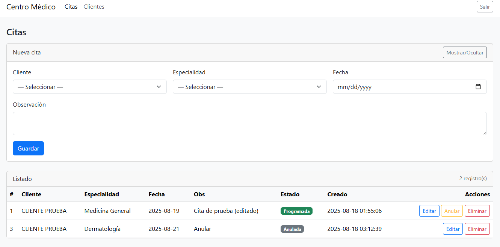
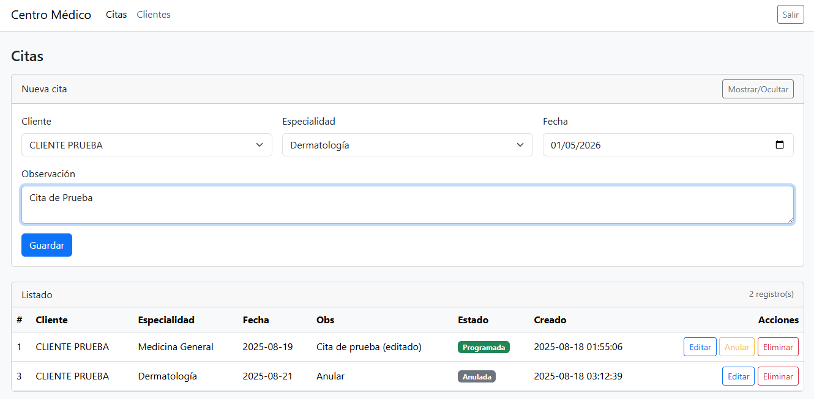
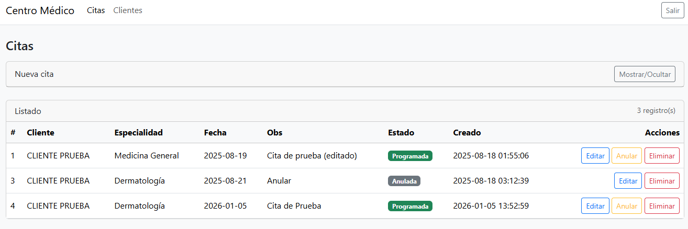
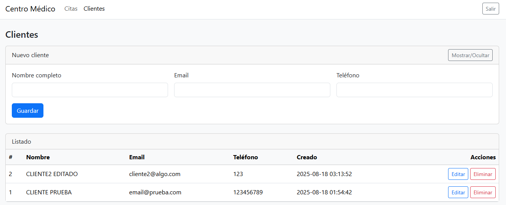

## Problem
A technical test required a small but production-minded web app to manage medical appointments: authenticate users, protect routes, and support full CRUD (create, list, edit) plus cancel/delete—while keeping the stack simple (no frameworks) and addressing real security concerns.

## Screenshots

## What I built
- A mini appointments system in plain PHP with MySQL using PDO + prepared statements.
- Auth (login/register/logout) with session-based protected routes.
- CRUD for clients and appointments, including cancel (soft state via status=anulada) and hard delete.
- CSRF protection for all POST actions.
- Basic UI with Bootstrap 5 and server-rendered views.
## Architecture
- Front controller / router script (public/index.php) to centralize routing.
- Thin controllers for request handling and validation.
- Repository layer (e.g., AppointmentRepository, ClientRepository) encapsulating DB queries.
- Lightweight migration runner (php src/migrate.php up|rollback) and CLI seeding for initial data.
- Environment-driven configuration via .env, including optional MySQL SSL settings.
## Challenges & tradeoffs
- Without a framework, I implemented essential web app “plumbing” manually (routing, sessions, CSRF, rendering) to keep it clean and test-ready.
- Balanced simplicity vs. correctness: used repositories + migrations to avoid “spaghetti PHP” while keeping setup minimal.
- Designed appointment rules (e.g., date not in the past) and handled cancel vs delete as separate behaviors (audit-friendly vs final removal).
## Results / Impact 
- Delivered a complete, secure CRUD app suitable for a technical assessment.
- Demonstrated backend fundamentals: routing, validation, DB design, security (CSRF + prepared statements), and maintainable structure without relying on frameworks.
- Fast local setup: migrations + built-in PHP server for quick review.
## What I’d improve next
- Add automated tests (PHPUnit) and CI checks.
- Implement role-based access (admin/user) and stronger password policy.
- Improve UX: better filtering/search, pagination, and flash messages.
- Add observability (structured logs) and Docker compose for repeatable setup.
- Consider a small API layer (JSON) to enable future SPA/mobile clients.
