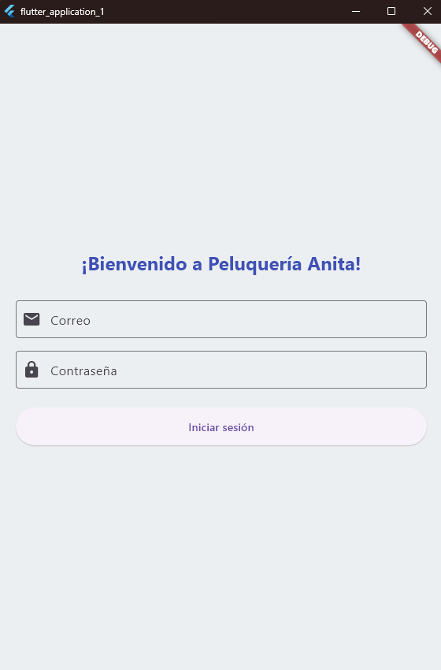
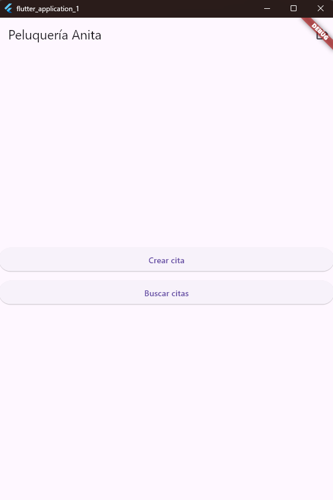
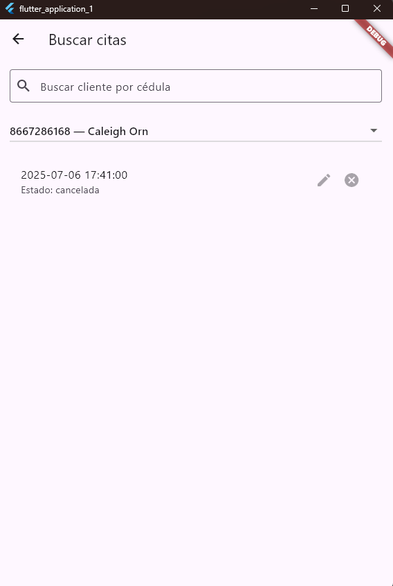
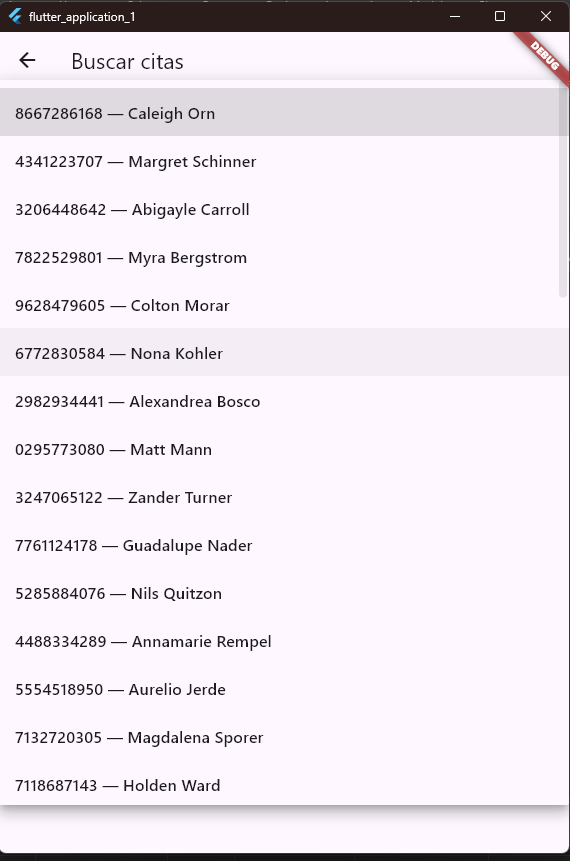
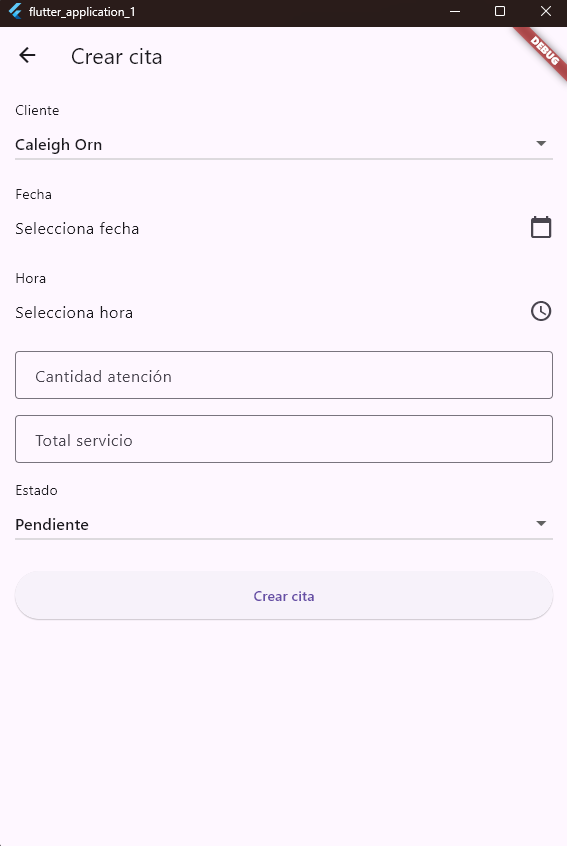
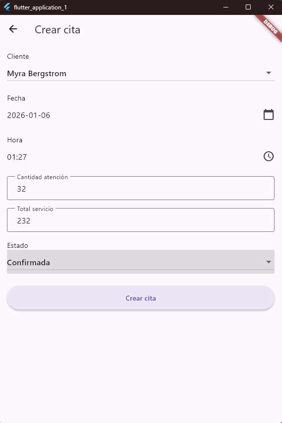
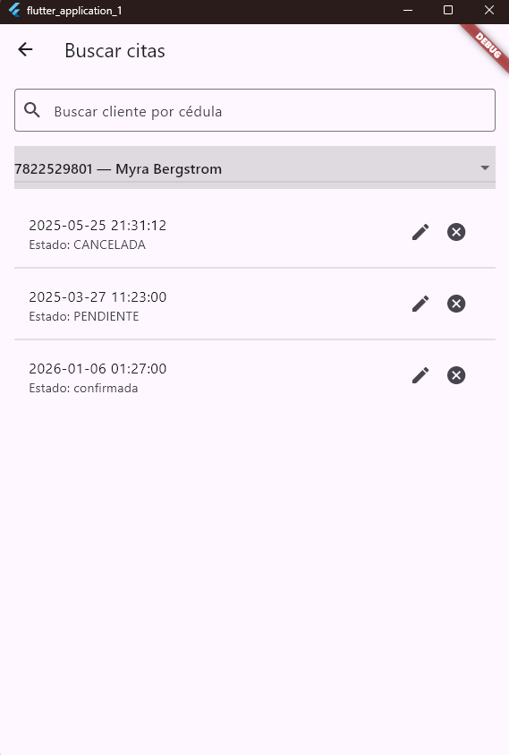

## Problem
As part of the same workflow, I needed a lightweight mobile client to authenticate users and create appointments from a phone—using a clear, testable structure and a simple integration contract with the backend API.
## Screenshots

## What I built
- A Flutter app with **login + token handling**.
- Screen flow: **Login → Home**, plus logout.
- Appointment creation form including:
  - client selection (dropdown),
  - native date/time pickers,
  - fields for service totals and status,
  - submit to backend API.
- A simple API layer (`ApiService`) to isolate HTTP calls from UI.

## Architecture
- `models/` for strongly typed entities (User, Appointment).
- `services/` containing a single **API service** encapsulating HTTP requests and auth token usage.
- `screens/` for UI: Login and Home.
- Configurable base URL for emulator vs real device networking (practical mobile dev setup).

## Challenges & tradeoffs
- Kept the app intentionally minimal to match assessment scope, focusing on correctness and clean separation.
- Networking differences between emulator and device required explicit base URL handling and cleartext traffic settings for local testing.
- Focused on reliability over UI complexity (simple screens, predictable state flow).

## Results / Impact
- Delivered a functional mobile client that integrates with the backend for real workflows (auth + create appointment).
- Demonstrated mobile fundamentals: API integration, token auth, typed models, and practical device testing considerations.

## What I’d improve next
- Add state management (Riverpod/Bloc) and stronger error handling UX.
- Add input validation, offline caching, and retry logic.
- Add tests (unit tests for ApiService + widget tests).
- Add appointment list/history and push notifications for reminders.