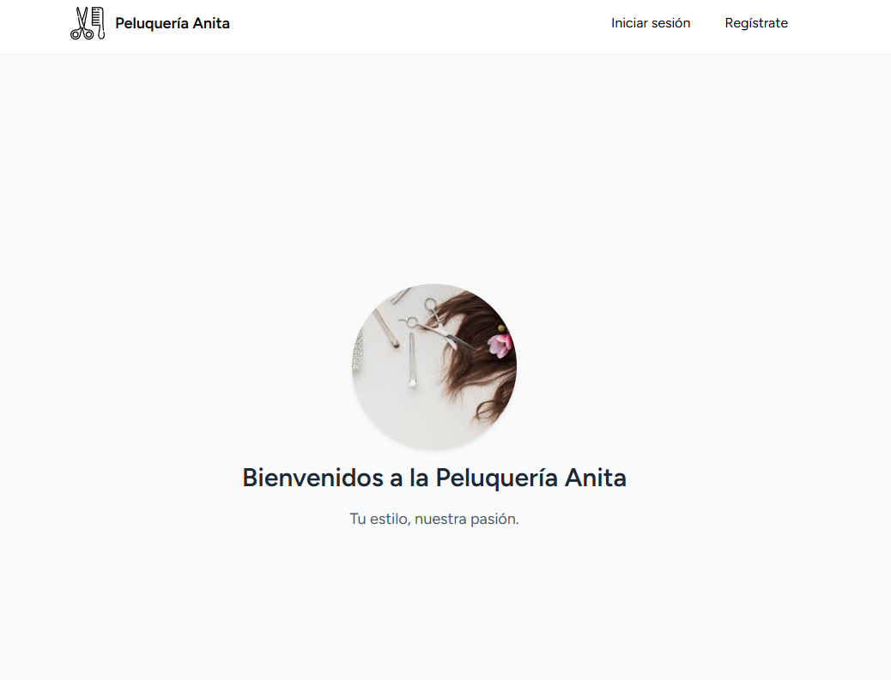
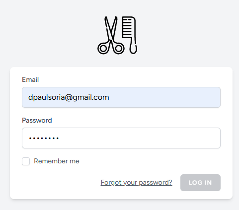
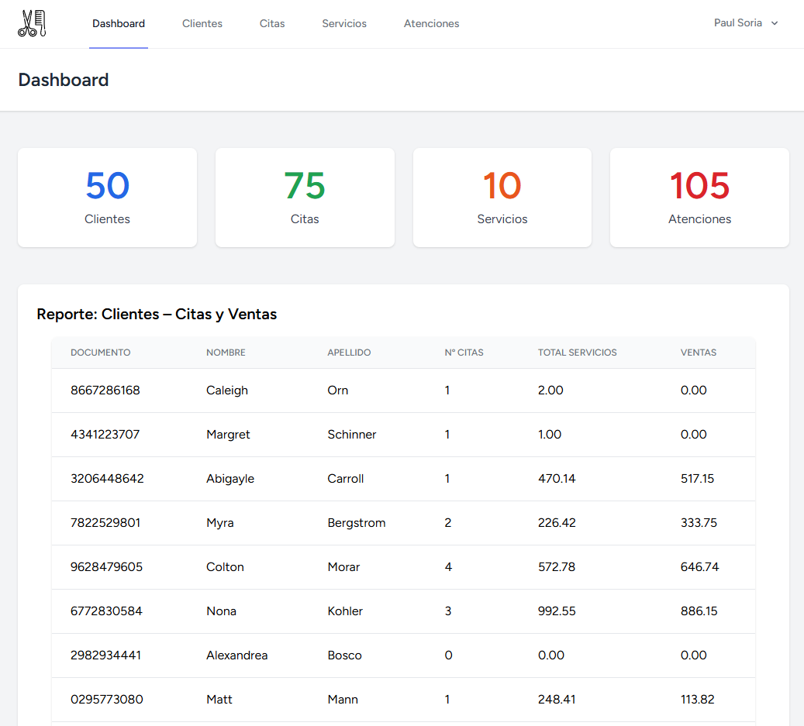
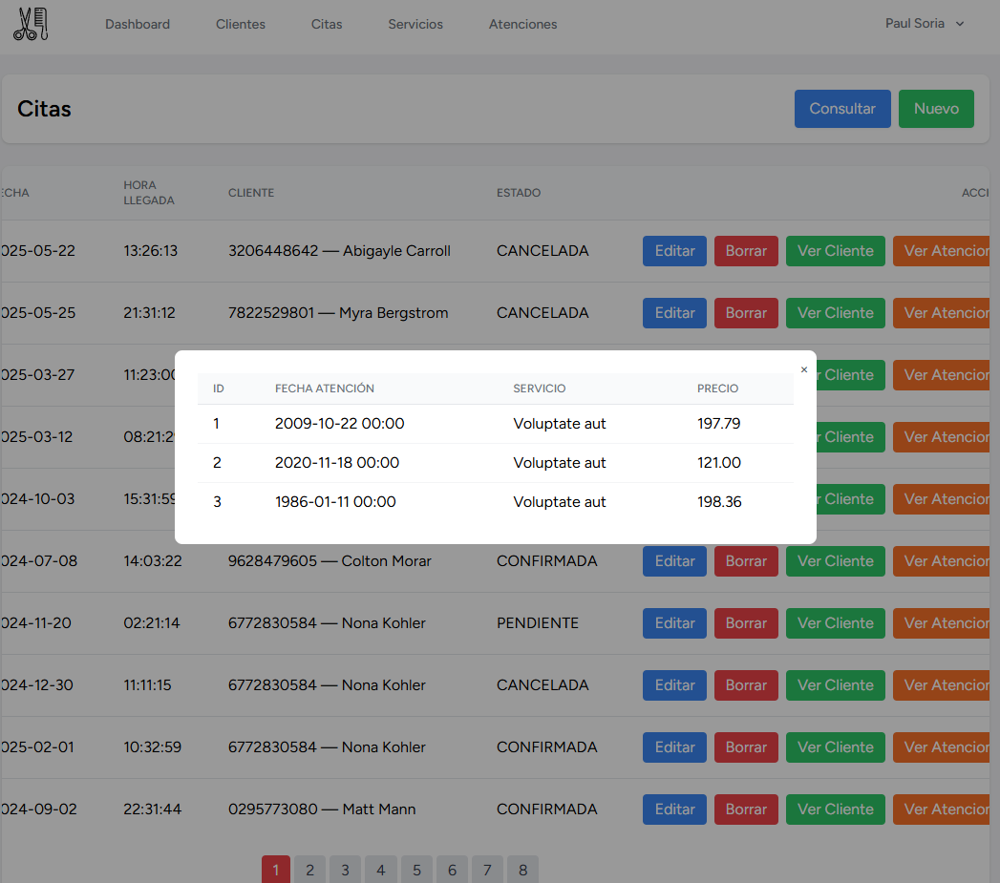
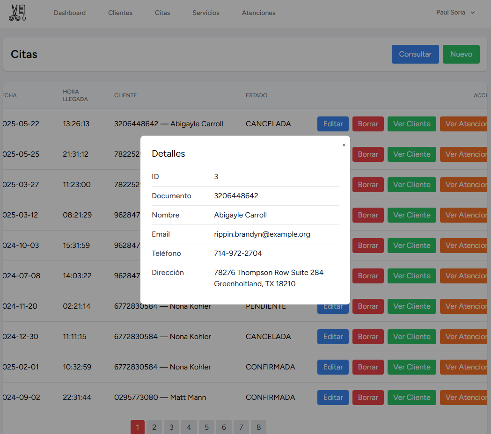
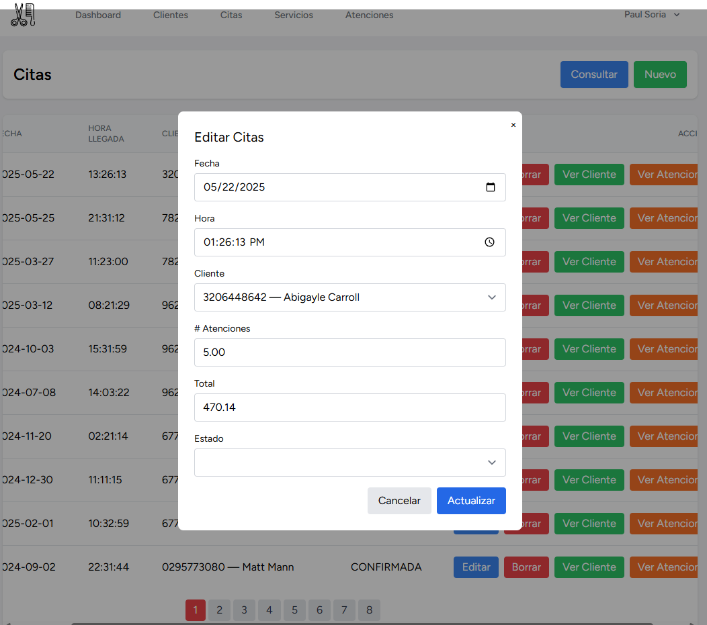
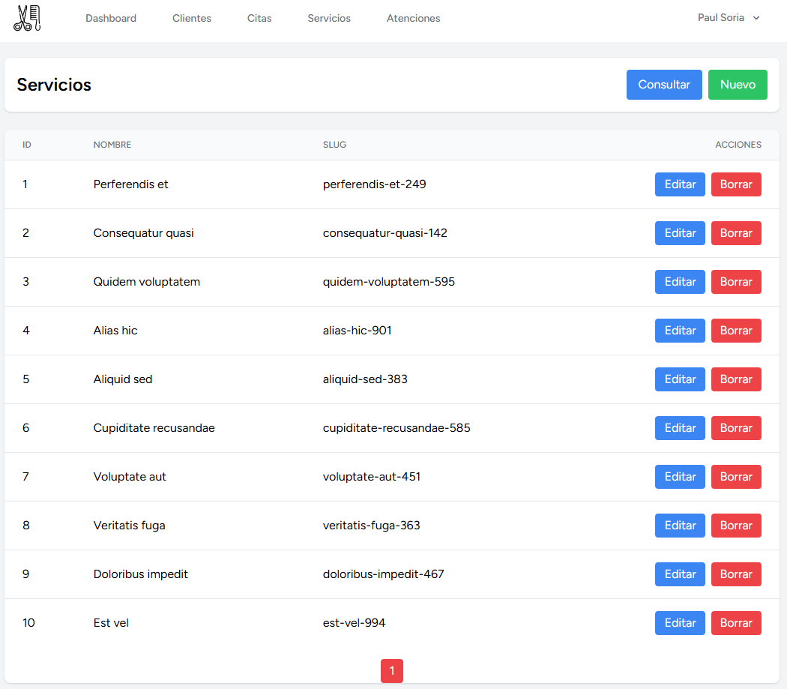

## Problem
A technical assessment required a production-minded full-stack system to manage a small business workflow: **clients, appointments, and services performed**. The app needed authentication, a clean Laravel + SPA-like structure, and a deployment approach compatible with a **cloud MySQL database that enforces SSL (CA certificate required)**.

## What I built
- A full-stack salon management web app to track:
  - **Clients**
  - **Appointments**
  - **Services**
  - **Attentions** (service sessions performed, typically linked to an appointment)
  - **Service prices** (historical pricing support)
- **Authentication & protected routes** with Laravel Breeze.
- **System user management** (operators/staff accounts), distinct from salon clients:
  - **Users ≠ Clients**: users log into the system; clients are the customers served.
- **Audit log** for tracking relevant actions (entity, timestamp, description).
- A deployment-friendly setup that works reliably for reviewers using **Docker** and env-driven configuration.

## Screenshots

## Core workflow (data model)
- A **Client** can have **many Appointments**
- An **Appointment** can have **many Attentions**
- Each **Attention** references **one Service** and stores the applied price (capturing historical pricing)
- Services can have multiple prices over time (price history)

## Architecture
- **Laravel 12** backend using Eloquent models and controllers.
- **Inertia.js routes** serving Vue 3 pages/components with server-provided props.
- **Vite** for asset bundling and **Tailwind CSS** for styling.
- **Dockerized runtime** bundling PHP + Node dependencies for consistent execution.
- Container startup approach to materialize SSL CA cert at runtime:
  - CA certificate stored as **Base64** in env (`MYSQL_ATTR_SSL_CA_B64`)
  - Startup script decodes it into `storage/certs/ca.pem`
  - Laravel connects to MySQL using SSL CA without shipping secrets in the image

## Challenges & tradeoffs
- **Reproducible setup for reviewers:** Docker was the most reliable way to avoid “it works on my machine” issues.
- **Cloud DB SSL requirement:** ensured the application can connect securely using a CA cert provided via environment variables (no secrets committed).
- **Env-driven asset URLs:** misconfiguring `ASSET_URL` (e.g., `ASSET_URL=localhost`) can break Vite asset paths, producing `/localhost/build/assets/...` 404s—documented clearly to avoid setup friction.
- Balanced assessment scope vs maintainability: kept structure clean and extensible without overengineering.

## Results / Impact
- Delivered a complete full-stack workflow (auth + CRUD modules + audit log) ready for evaluation.
- Demonstrated end-to-end delivery: backend modeling, full-stack integration, Docker packaging, and secure environment configuration for cloud DBs.

## What I’d improve next
- Add automated testing (feature/integration) + CI pipelines.
- Add role-based access control (admin/staff) and more detailed audit events.
- Improve UX: filters, pagination, and stronger validation feedback.
- Add observability: structured logs, error reporting, and standardized exception handling.
