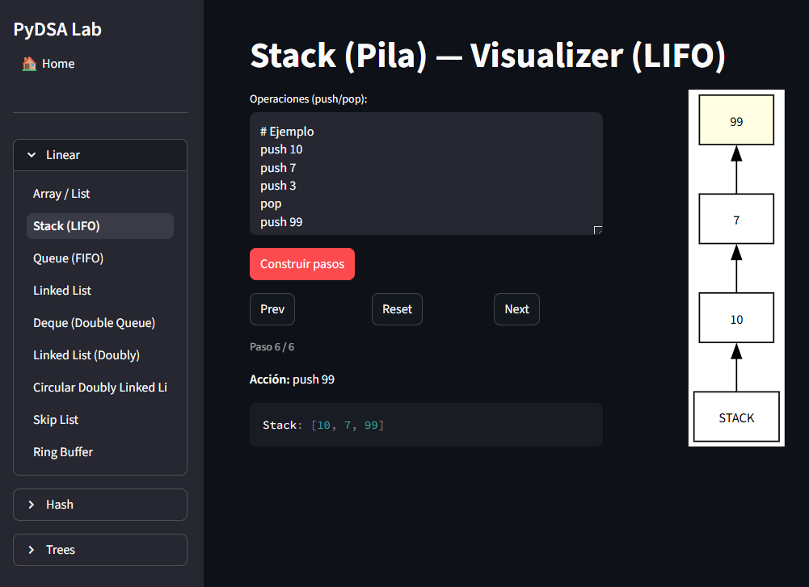
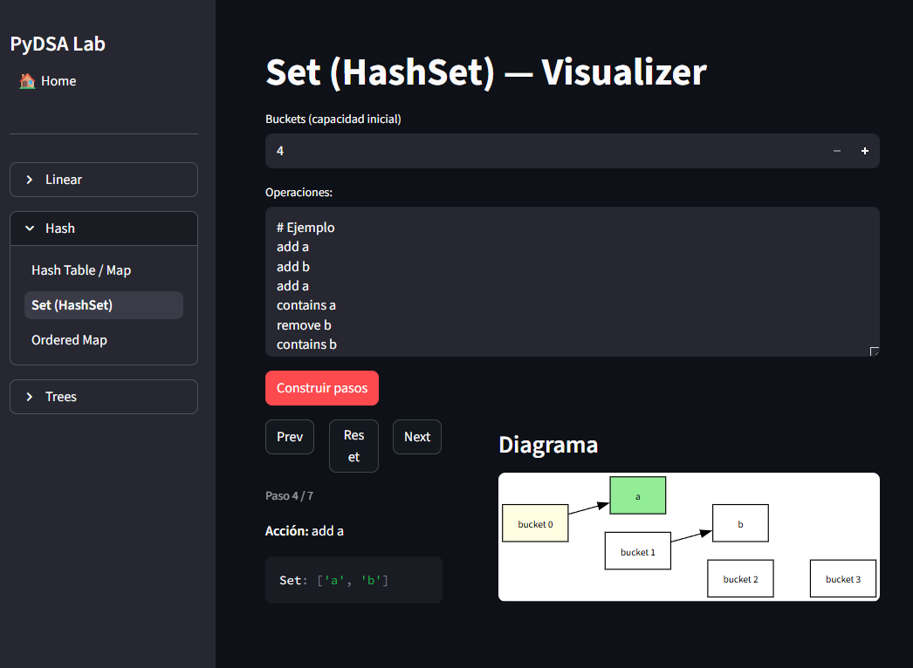
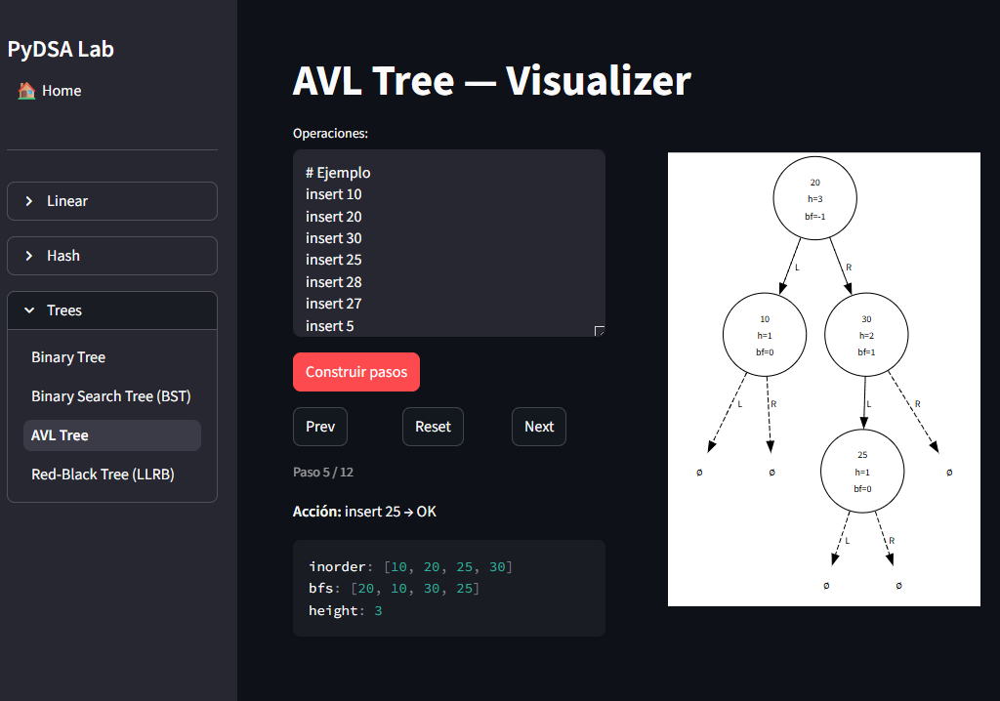

## Problem
Learning data structures only through the console becomes abstract: it’s hard to see the real internal state (pointers, buckets, rotations, traversals).
I wanted a way to **practice interview-style** but with immediate visual feedback.

## What I built
An interactive lab that simulates operations **step by step**:
- Executes operations line by line (with `#` comments)
- Generates navigable snapshots (Prev/Next/Reset)
- Renders the state with Graphviz and also shows the state as text
- Includes linear, hash, and tree modules (BST/AVL/LLRB)

## Screenshots

## Architecture
- **pages/**: UI por módulo (Streamlit)
- **core/structures/**: data structure implementations (DS)
- **core/algos/**: parseo + handlers + build_steps (simulación)
- **core/render/**: `*_to_dot` (Graphviz)
- **core/stepper.py**: snapshot navigation
- **tests/**: smoke tests + ops/render tests

## Challenges & tradeoffs
- Unifying contracts: consistency between `Step` (values/buckets/etc.) and what tests/pages consume.
- `items()` in some structures as a generator: great for performance, but in tests/UI it’s sometimes better to materialize with `list(...)`.
- Keeping `algos` decoupled from `render` by passing `dot_builder` from the page.

## Results / Impact
- A repeatable workflow to practice DS with real visualization.
- Tests + hooks (ruff/pre-commit) keep quality high and prevent regressions during refactors.

## What I’d improve next
- Export snapshots to JSON to save/load scenarios
- Autoplay mode (play/pause + speed)
- More modules: Heap / Trie / DSU / LRU Cache
- Better UI: operation history and per-structure filters
