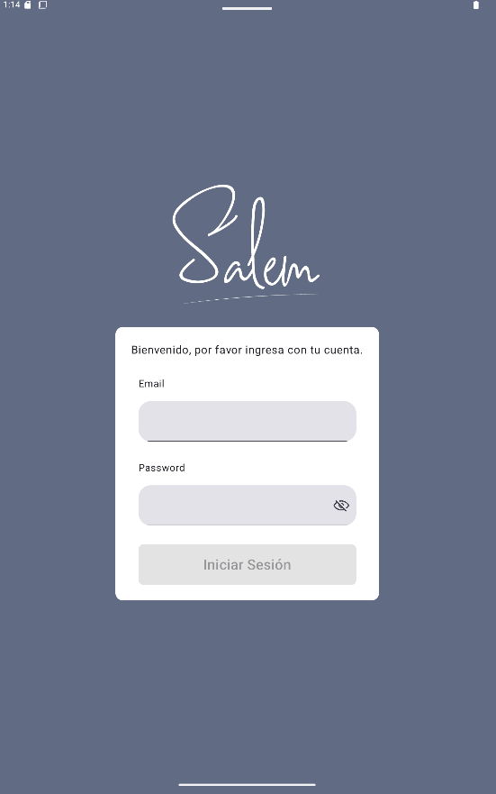
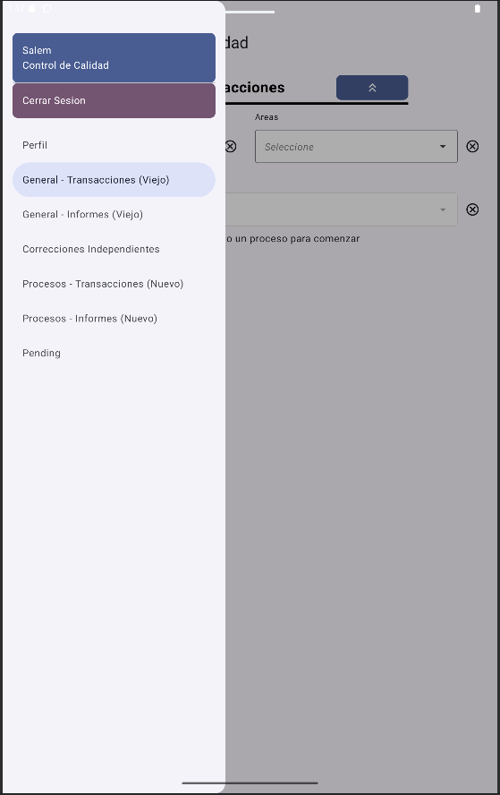
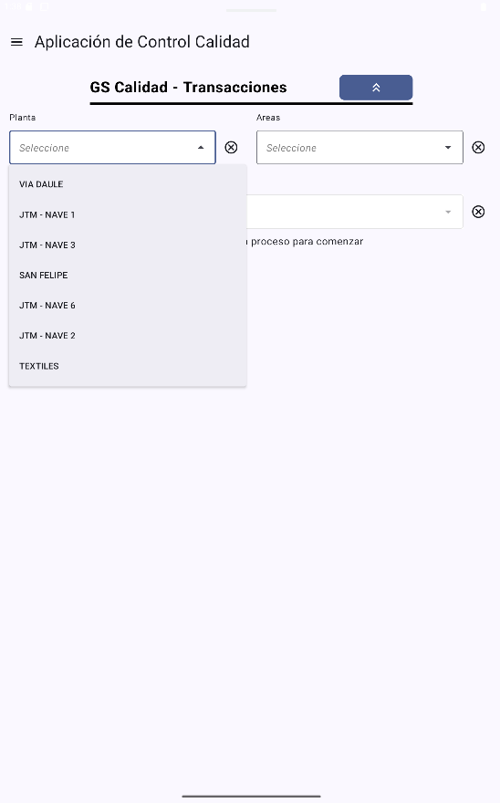
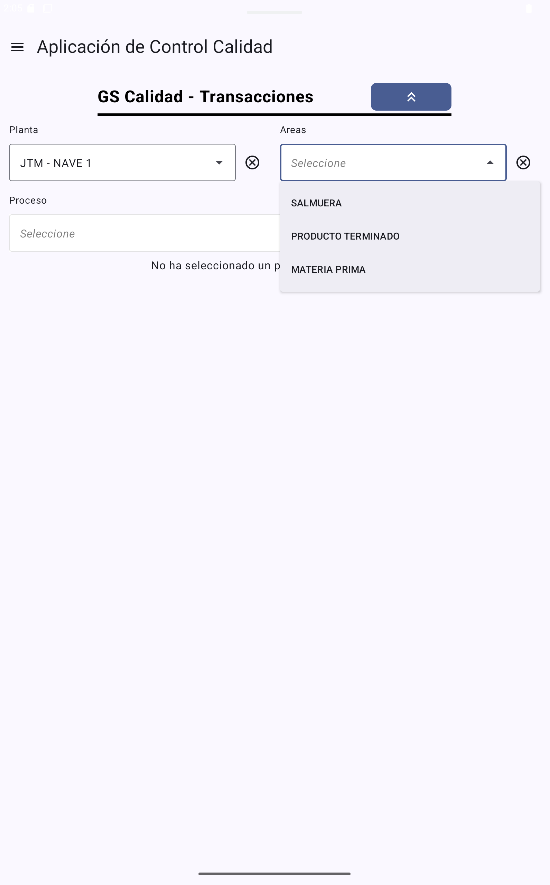
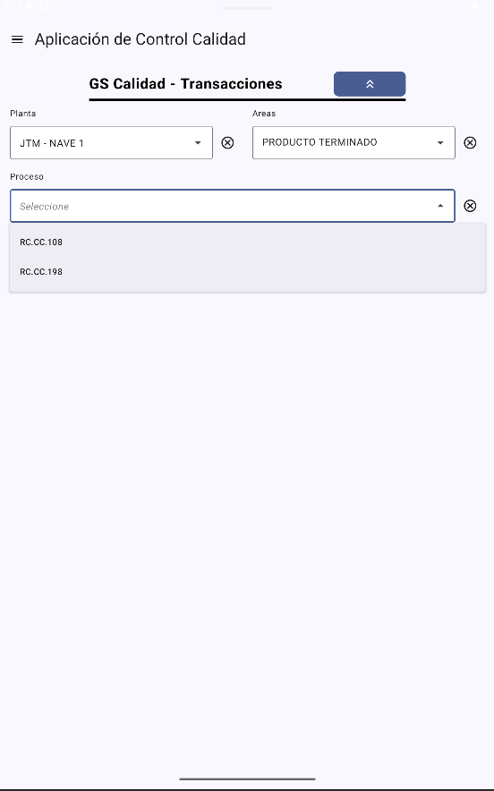
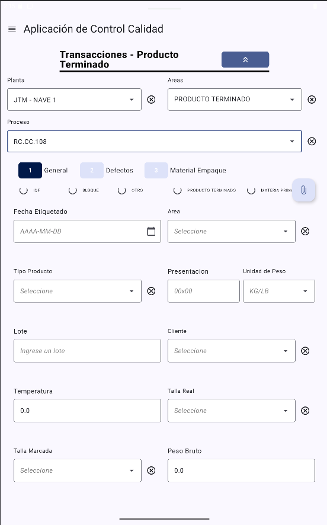
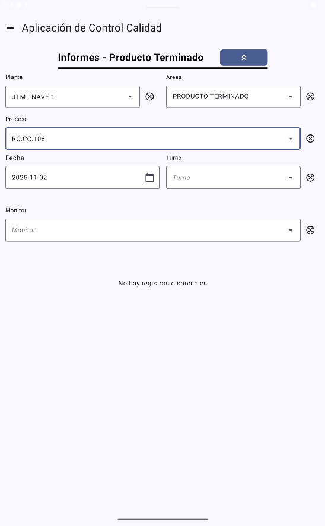

## Problem
Production/quality workflows happen on the floor where connectivity is unstable. Operators still need to:
- log in, load reference lists (plants, areas, users, cuts, etc.)
- create quality records and attach evidence (photos / corrective actions)
- keep data consistent with the backend without blocking the operation

The system needed to work reliably **offline**, then synchronize safely when internet becomes available.

## What I built
An **offline-first** Android application used by the operations/quality team:
- **First-run bootstrap via JSON assets** (lists and configuration). If the device has internet, lists are refreshed from the backend and the local copies are replaced; otherwise, the app uses the bundled JSON as the initial source of truth.
- **Local persistence with Room** for both reference data and records (forms).
- **Auth flow optimized for offline**: users are fetched from the backend; password validation happens locally by hashing the login attempt and comparing with the stored hash (Argon2id).
- **Record creation + offline queue**: when a user saves a record:
  - if online → POST immediately
  - if offline → store locally with `sync_state = 0` and queue it for later
- **Attachment pipeline** (photos + corrective actions) uploaded after the main record is successfully created.
- **Edit authorization flow**: some reports can be edited only with a supervisor “unlock key”; the authorization is stored and synced together with the update.
- **Reporting module**: list/search/preview and edit capabilities (with authorization), aligned with the same workflows available in the web app.

## Screenshots

## Architecture
- **UI:** Jetpack Compose + Navigation (drawer-based navigation by environment)
- **DI:** Hilt (modules for Room DAOs, Retrofit services)
- **Local data:** Room database with frequent schema changes handled through migrations
- **Networking:** Retrofit + OkHttp + Moshi
  - Auth interceptor injects Bearer token on every request
  - Custom `ApiResult` call adapter to unify success/error/network failure handling
- **Sync engine:** WorkManager background worker
  - runs periodically (e.g., every ~15 min) and pushes all local records with `sync_state = 0`
  - uploads child entities / attachments after the parent record is accepted by the backend
  - logs failed posts to a backend endpoint for traceability

**Tradeoff (current state):** the mobile app is treated as the primary writer. If a record is edited on the web, that change may not reflect back on mobile, and later edits from mobile can overwrite web edits. This is known and tracked as a future improvement.

## Challenges & tradeoffs
- **Data consistency & conflict resolution:** ensuring queued offline records remain valid when reference lists change.
- **Unstable connectivity:** uploads must be resilient, retry safely, and not corrupt state.
- **Large domain model:** many forms, lists, and related attachments required strong typing, parsing and mapping.
- **Migrations at scale:** Room schema evolves frequently; required a disciplined migration strategy and testing.

## Results / Impact
- Operators can keep working even with poor connectivity (no data loss).
- Records are standardized across factories and departments.
- Reduced delays by allowing capture on the floor + automated background synchronization.
- Improved traceability: failed sync attempts are reported and auditable.

## What I’d improve next
- Introduce **bidirectional sync** and a clear **conflict strategy** (server timestamps, versioning, or CRDT-like merge rules depending on entity).
- Replace “replace JSON list” with **delta sync** (ETags/If-Modified-Since) and caching to reduce bandwidth.
- Add **sync observability**: user-facing sync status, error dashboard, and structured logs.
- Expand automated tests around migrations + sync (instrumentation tests + fake API).
