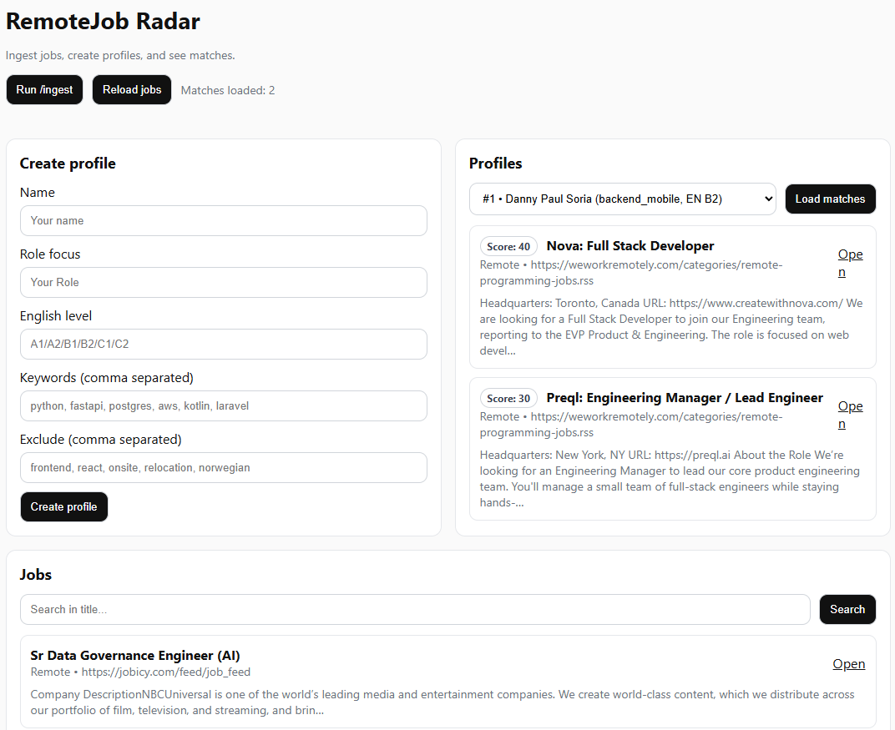
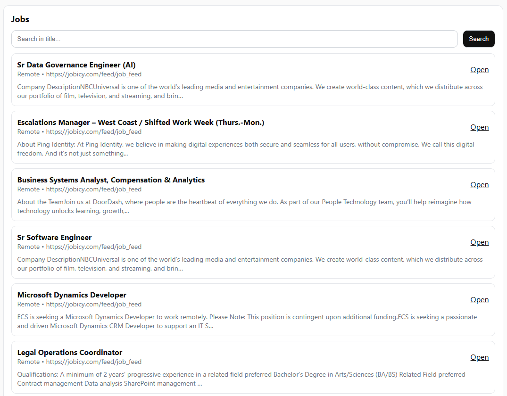

## Problem
Finding remote backend/mobile roles is noisy: offers are spread across many boards, repeated across sources, and rarely filtered to your preferences.

## What I built
A lightweight job aggregator + matcher:
- Ingests job postings from multiple **RSS feeds**
- Stores them in **PostgreSQL**
- Lets you create **profiles** (keywords + excluded terms)
- Returns **ranked matches** with a simple scoring model

## Screenshots

## Architecture
- **FastAPI API** (`/ingest`, `/jobs`, `/profiles`, `/matches`)
- **Postgres in Docker** for local persistence
- **SQLAlchemy** for data access
- Minimal UI served by the backend for quick visualization

## Challenges & tradeoffs
- RSS feeds vary a lot in structure, so normalization (company/location) is best-effort.
- Kept the first version simple: scoring is keyword-based (fast + explainable), not ML.

## Results / Impact
- One command to populate the DB (`POST /ingest`)
- Profiles instantly surface the most relevant jobs without manual searching

## What I’d improve next
- CRUD for RSS sources
- Better parsing/normalization (company, location, contract type)
- More filters (timezone, English-only, remote-only, salary)
- Scheduled ingest + notifications (email/telegram)
- Full-text search and saved searches
